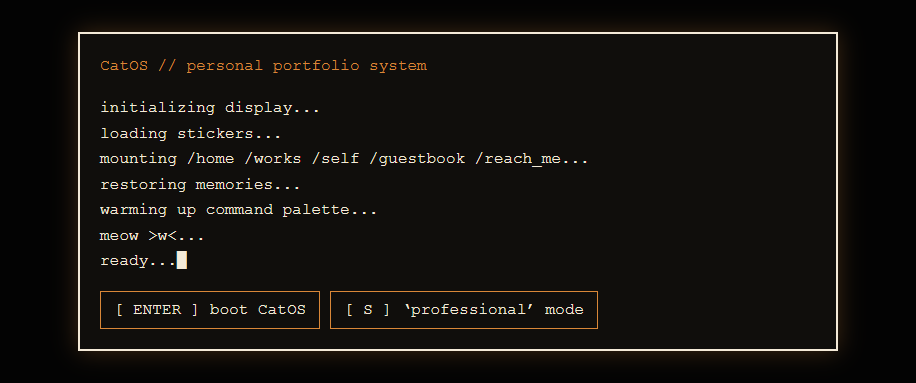

<h1 align="center">CatOS Portfolio</h1>

<p align="center">
  An interactive portfolio disguised as a small personal operating system.
</p>

<p align="center">
  
  
  
  
  
</p>

---

## Overview

CatOS is a personal portfolio built as a fake desktop operating system.

Instead of scrolling through a standard page, visitors explore a desktop, open files, move windows, click stickers, play small games, and discover projects through an interactive interface.

It is intentionally expressive, a little strange, and built to feel more personal than a template.

<p align="center">
  
</p>

---

## Live Site

https://gumoraes11.github.io/Portfolio/

---

## Tech Stack

| Area | Tools |
|---|---|
| Structure | HTML |
| Styling | CSS |
| Interactivity | JavaScript |
| Backend | Supabase |
| Games | Canvas API |
| Storage | localStorage and Supabase |

---

## Features

### Window System

Reusable windows are used for pages, files, folders, and apps.

- Draggable and resizable windows
- Focus and layering system
- Close, minimize, and maximize controls
- Scrollable window content

### Desktop Environment

The desktop acts like a small file system. Icons open different parts of the portfolio and can be rearranged.

```txt
portfolio_os.app
settings.app
commands.txt
graveyard.folder
unorganized_files.folder
notes.txt
memory_fragments.log
snake.game
pong.game
```

### Command Palette

Press `/` to open the command palette.

```txt
open /home
open /works
open /self
open /guestbook
open settings
pet cat
reset desktop
safe mode
```

### Boot Modes

```txt
[ ENTER ] boot CatOS
[ S ] professional mode
```

Normal mode opens the full CatOS desktop.  
Professional mode opens a cleaner version of the portfolio.

---

## Pages

| Page | Purpose |
|---|---|
| `/home` | Landing page and first impression |
| `/works` | Project cards and detailed project windows |
| `/self` | Character-sheet style about page |
| `/guestbook` | Shared visitor messages |
| `/reach_me` | Contact links |

---

## Apps and Files

Most apps, folders, and text files are defined as popup content.

```txt
settings.app
commands.txt
graveyard.folder
unorganized_files.folder
sketchbook.folder
memory_fragments.log
secret.log
```

---

## Games

### Snake

Canvas-based Snake game with arrow-key controls, local high score tracking, and shared leaderboard support.

### Pong

Canvas-based Pong game with a CPU opponent, rally tracking, local high score, and shared leaderboard support.

---

## Supabase

CatOS uses Supabase for shared online data.

```txt
guestbook_messages
game_scores
```

Used for:

- guestbook messages
- Snake scores
- Pong scores

The frontend uses a public Supabase key with row-level security policies configured in Supabase.

---

## Design Goals

- Make a portfolio that feels personal and exploratory
- Avoid a generic modern portfolio layout
- Combine art, code, games, and interface design
- Keep the site handmade without making it unusable
